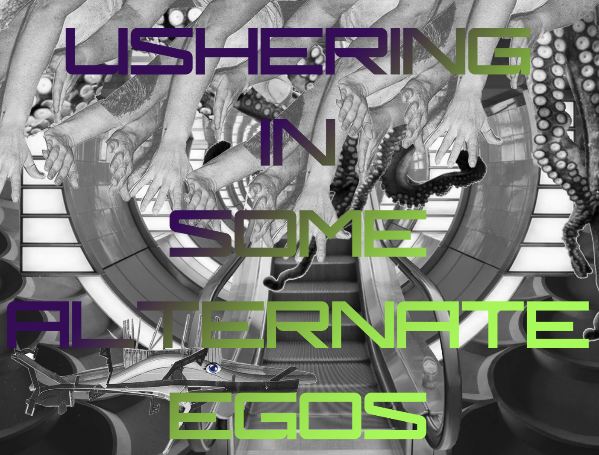

USHERING IN SOME ALTERNATE EGOS 
Date: 14 February 2025 
Time: 19:00-21:00 
Location: Varia (Gouwstraat 3), ROTTERDAM

USHERING IN SOME ALTERNATE EGOS - a performative script reading by Antye Guenther and Philippine Hoegen.
What started as a fl irtatious and whimsical exercise in collective script writing, developed into a collaborative exploration of our loves, fears and desires regarding work and research. This entanglement of us and our lives invited some diff erent selves, or alter ego's to insert themselves mischievously into our artistic (research) practices. In this performative reading, we wish to share with you the scenes we dreamed up and the strategies we stumbled upon along the way, and engage you in a process of enticing and embodying these coveted others.
**Philippine Hoegen** is an artist based in Belgium and The Netherlands, working mainly with performance as an artistic medium and as a research strategy. Hoegen is currently a researcher and PD Candidate at the Professorship Expanding Artistic Practices, HKU University of the Arts Utrecht, with the project Performing Working, in which she looks at work through the lens of performance and performance through the lens of work, asking the questions who we are when we work, and who when we don't, or can't. She problematises the prioritization of waged work, exploring the value of unpaid and invisible labor and the marginalization of those who perform it.https://www.researchcatalogue.net/view/2550715/2550716
**Antye Guenther**, originally from East Germany, works as a visual artist and artist-researcher. In her practice-based PhD, she collaboratively examines biometric data software visualisations, looking at what kind of hierarchies, norms and ideologies are installed in the underlying 3D imaging practices. Highly invested in exploring non-digital research methods to challenge powerful digital systems, Guenther brings her ceramic practice into tension with data and software regimes and develops the performative alter ego of the fabulous DATA DIVA as a dazzling research tool.
This events falls under Varia's Homebrewing research thread and is supported by the Creative Industries Fund NL.
https://varia.zone/en/ushering-in-some-alternate-egos.html
https://varia.zone/ushering-in-some-alternate-egos.html
varia (Gouwstraat 3, Rotterdam) is a space for developing collective approaches to everyday technology. As varia members, we maintain and facilitate a collective infrastructure from which we generate questions, opinions, modifi cations, help and action. We work with free software, organise events and collaborate in diff erent constellations. varia fi gures things out as they go, tries to keep notes, is multilingual, has open hours and can be contacted at info[@]varia.zone.