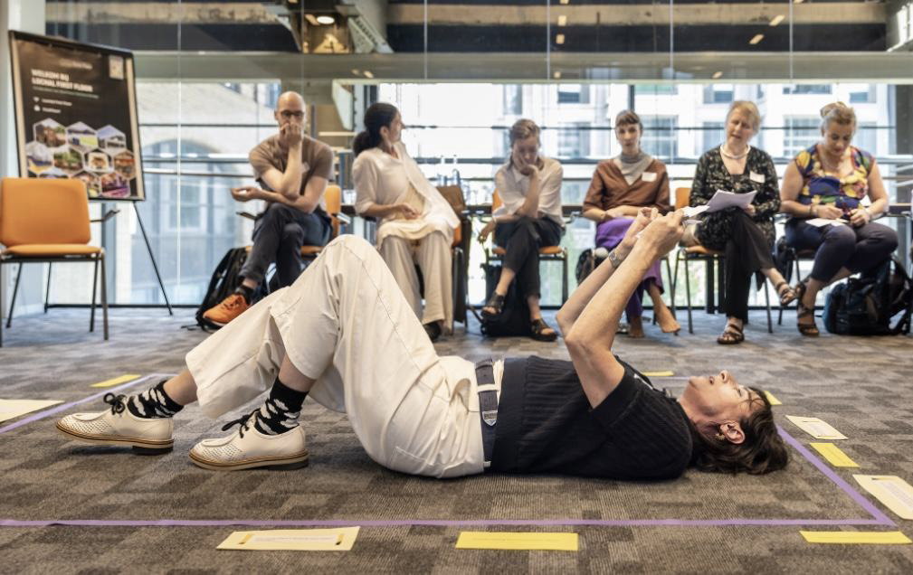
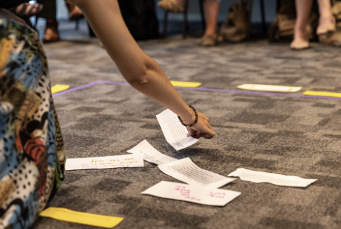
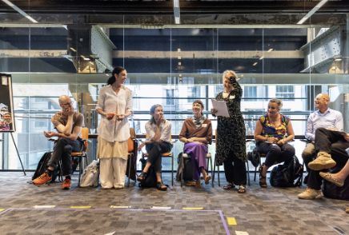

The Resonance of PD On June 20, 2025, the Professional Doctorate in Arts + Creative hosted its annual symposium, this time at LocHal in Tilburg. This gathering brought together PD candidates, professors, and respondents from the professional fi eld to refl ect on where, how, and with whom their work resonates. Throughout the afternoon, the symposium explored how third-cycle applied artistic and design research connects with societal urgencies and professional contexts through dialogue, interviews, thematic sessions, and shared refl ections.

**Embodied Knowledge**
A Multivocal Scripttogether Session, with Sophia Badoutsou and Emily Huurdeman This session invited participants to literally step into a performative space. PD candidates Sophia Badoutsou, Emily Huurdeman, and Philippine Hoegen led a session grounded in physical movement and aff ective knowledge. Using a marked arena, prompts, and performance, they demonstrated how the body can be both a site and method of inquiry, as seen in their exposition: 
https://www.researchcatalogue.net/view/3753164/3775117 
The session blurred lines between audience and presenter, encouraging everyone to explore how knowledge is held in movement, silence, emotion, and gesture.